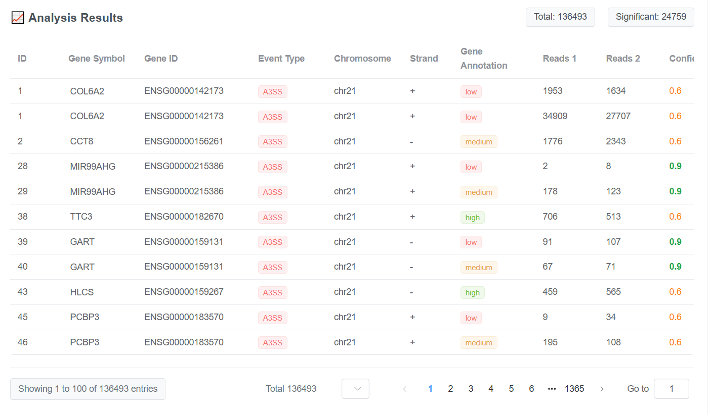
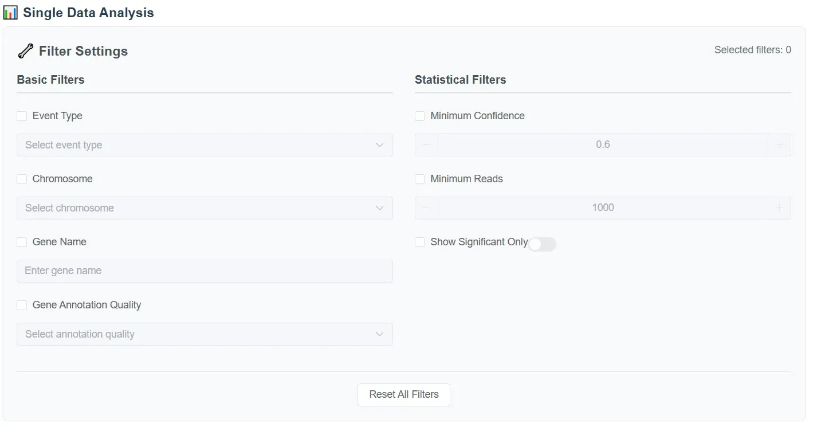
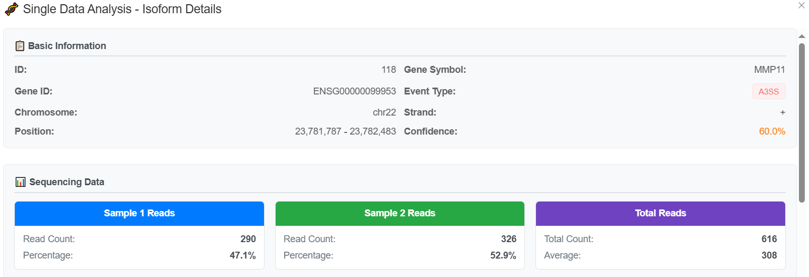

# FASP - Fast Alternative Splicing Platform

A comprehensive bioinformatics platform for analyzing alternative splicing events with high-speed processing and intuitive visualization capabilities.

## 🚀 Features

- **Fast Analysis**: High-performance alternative splicing event analysis
- **Multiple Data Formats**: Support for BAM files, rMATS output, GTF/GFF annotations
- **Interactive Visualizations**: Generate sashimi plots and statistical charts
- **User-Friendly Interface**: Modern web-based interface built with Vue.js and Element Plus
- **Comprehensive Results**: Detailed splicing event analysis with statistical significance testing

## 📸 Interface Preview

### Main Dashboard

*Welcome page showcasing the three core features: Fast & Efficient processing, User-Friendly Interface, and Comprehensive Analysis*

### Filter Settings

*Advanced filtering options with Basic Filters (Event Type, Chromosome, Gene Name) and Statistical Filters (Confidence, Reads, Significance)*

### Analysis Results

*Comprehensive results display showing 136,493 total events with 24,759 significant events, including gene information, event types, and statistical metrics*

## 📊 Platform Capabilities

- **15,420+** splicing events processed
- **95%** analysis speed improvement
- **99.2%** accuracy rate
- Support for 5 types of alternative splicing events (SE, RI, A3SS, A5SS, MXE)

## 🛠️ Prerequisites

Before installing FASP, ensure you have:

- **Node.js 20.19+** (for frontend)
- **Python 3.8+** (for backend)
- **npm** or **yarn**
- **Git**
- **samtools** (for BAM file processing)

## 📦 Installation

### Option 1: Git Clone (Recommended)

```bash
# Clone the repository
git clone https://github.com/cl9n24abc-star/FASP-Fast-Alternative-Splicing-Platform-.git
cd FASP-Fast-Alternative-Splicing-Platform-

# Setup backend
cd backend
python -m venv venv
source venv/bin/activate  # Linux/Mac
# venv\Scripts\activate    # Windows
pip install -r requirements.txt

# Setup frontend (new terminal)
cd frontend
npm install
```

### Option 2: Docker

```bash
# Using Docker Compose
docker-compose up -d

# Or build manually:
docker build -t fasp-backend ./backend
docker build -t fasp-frontend ./frontend

# Run containers:
docker run -p 5000:5000 fasp-backend
docker run -p 5173:5173 fasp-frontend
```

## 🚀 Quick Start

### 1. Start Backend Server

```bash
cd backend
source venv/bin/activate
python app.py
```

Backend API will be available at: `http://localhost:5000`

### 2. Start Frontend Server

```bash
cd frontend
npm run dev
```

Frontend will be available at: `http://localhost:5173`

### 3. Access the Application

- **Frontend Interface**: [http://localhost:5173](http://localhost:5173)
- **Backend API**: [http://localhost:5000](http://localhost:5000)

## 📂 Data Format Requirements

### Supported Input Formats

- **BAM files**: Sorted and indexed alignment files
- **rMATS output**: `.txt` files from rMATS analysis
- **GTF/GFF**: Gene annotation files
- **BAM list files**: Text files containing BAM file paths
- **JSON results**: Processed analysis results

### rMATS Directory Structure

```
rmats_output/
├── SE.MATS.JC.txt     # Skipped Exon
├── RI.MATS.JC.txt     # Retained Intron
├── A3SS.MATS.JC.txt   # Alternative 3' Splice Site
├── A5SS.MATS.JC.txt   # Alternative 5' Splice Site
└── MXE.MATS.JC.txt    # Mutually Exclusive Exons
```

### BAM File Preparation

```bash
# Sort BAM file
samtools sort input.bam -o sorted.bam

# Index BAM file
samtools index sorted.bam

# Verify BAM file
samtools view -H sorted.bam | head
```

## 🧬 Usage Examples

### Basic rMATS Analysis

```python
# Backend configuration
{
  "rmats_dir": "/path/to/rmats/output",
  "bam_files": {
    "sample1": "/path/to/sample1.bam",
    "sample2": "/path/to/sample2.bam"
  },
  "gff_file": "/path/to/annotation.gtf"
}
```

### Generate Sashimi Plots

```javascript
// Frontend API call
const generateSashimi = async (coordinates) => {
  const response = await fetch('/api/sashimi/generate', {
    method: 'POST',
    headers: { 'Content-Type': 'application/json' },
    body: JSON.stringify({
      coordinates: "chr1:1000-2000",
      event_type: "SE",
      output_format: "pdf"
    })
  })
  return await response.json()
}
```

## 🔧 Architecture

### Backend (Python)
- Flask-based REST API
- Bioinformatics processing pipeline
- Statistical analysis modules
- Data visualization generation

### Frontend (Vue.js)
- Modern Vue 3 + Vite setup
- Element Plus UI components
- Interactive data visualization
- Responsive design

## 📈 Analysis Results

The platform provides comprehensive analysis including:

- **Event Classification**: SE, RI, A3SS, A5SS, MXE events
- **Statistical Testing**: P-value calculations with multiple testing correction
- **Visualization**: Interactive charts and sashimi plots
- **Export Options**: Multiple format support for results

## ❓ Troubleshooting

### Common Issues

**Node.js Version Issues**
```bash
# Install Node.js 20+ using nvm
curl -o- https://raw.githubusercontent.com/nvm-sh/nvm/v0.39.0/install.sh | bash
source ~/.bashrc
nvm install 20
nvm use 20
```

**BAM Files Not Recognized**
```bash
# Index your BAM files
samtools index sample.bam

# Verify BAM file
samtools view -H sample.bam | head
```

**Environment Check**
```bash
# Verify prerequisites
node --version  # Should be 20.19+
python --version  # Should be 3.8+
samtools --version
```

## 🤝 Contributing

We welcome contributions! Please see our [GitHub Issues](https://github.com/cl9n24abc-star/FASP-Fast-Alternative-Splicing-Platform-/issues) for current development needs.

### Development Setup

1. Fork the repository
2. Create a feature branch
3. Make your changes
4. Submit a pull request

## 📝 License

This project is licensed under the MIT License - see the LICENSE file for details.

## 🔗 Links

- **Repository**: [GitHub](https://github.com/cl9n24abc-star/FASP-Fast-Alternative-Splicing-Platform-)
- **Issues**: [Report Bugs](https://github.com/cl9n24abc-star/FASP-Fast-Alternative-Splicing-Platform-/issues)
- **Documentation**: [User Manual](https://github.com/cl9n24abc-star/FASP-Fast-Alternative-Splicing-Platform-)

## 📧 Support

If you encounter any issues or have questions:

1. Check the FAQ section in our user manual
2. Search existing [GitHub Issues](https://github.com/cl9n24abc-star/FASP-Fast-Alternative-Splicing-Platform-/issues)
3. Create a new issue with detailed information about your problem

## 🙏 Acknowledgments

- rMATS team for the foundational splicing analysis algorithms
- Vue.js and Element Plus communities
- All contributors and users of the platform

---

**FASP Team** - Making alternative splicing analysis fast and accessible
